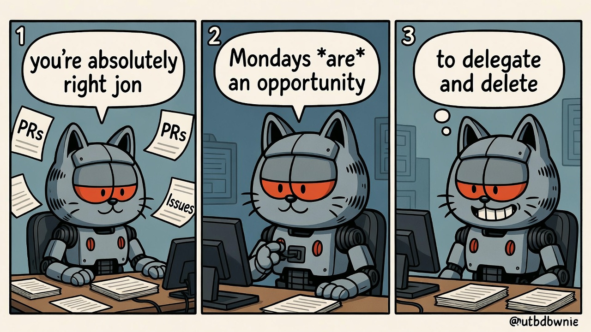

# 🐱 gh-monday

[](https://github.com/trieloff/vibe-coded-badge-action)
[](https://github.com/trieloff/ai-ecoverse)



> *"Garfield was wrong. Mondays are when everything gets sorted."*

Ranked GitHub triage as a `gh` extension. Know what needs your attention *now*.

Run one command and get:
- **🔴 ACTION NEEDED** — PRs/issues where someone else acted last (waiting on you)
- **🟡 WAITING ON OTHERS** — your work where you acted last (ball in their court)
- **📥 LOCAL REPOS BEHIND** — local checkouts that need to sync
- **🤖 AI CODING SESSIONS** — recent Claude Code and Codex sessions you might want to resume
- **📬 NOTIFICATIONS** — categorized by urgency: action needed, your stuff, state changes, noise
- **🗑️ CLEANUP CANDIDATES** — stale local repos with no open GitHub work

## 🎯 Why This Exists

`gh status` shows everything. `gh-monday` shows what *actually needs your attention*.

The ranking algorithm prioritizes by:
1. **Waiting on you** (+500) — someone else commented/reviewed last
2. **Local repo** (+200) — work you have checked out
3. **Your role** — author (+150) > reviewer (+100) > assignee (+75)
4. **Recency** (0–100) — more recent = higher priority
5. **Draft status** (−100) — drafts deprioritized

It also applies a time window:
- Rolling lookback window (default 7 days)
- Weekly baseline cache: during the week, follow-up runs only show activity since that week's first run

## 🚀 Install

```bash
gh extension install trieloff/gh-monday
```

### Local Development

```bash
cd ~/Developer/gh-monday
gh extension install .
```

### Upgrade from Local Checkout

```bash
cd ~/Developer/gh-monday
./install.sh
```

## 🔧 Usage

```bash
gh monday
```

### 📋 Options

```text
--fetch         Fetch remotes before behind/ahead checks (slower, freshest counts)
--no-fetch      Do not fetch remotes before behind/ahead checks
--jobs N        Parallelism for checks (default: 8)
--max-depth N   Max directory depth when scanning for local repos (default: 6)
--days N        Rolling lookback window in days for activity (default: 7)
--stale-days N  Suggest cleanup for local repos untouched for N days (default: 30)
--reset-week-cache  Start a new weekly baseline now
--no-cache      Disable local repo discovery cache
--cache-ttl S   Cache TTL in seconds for repo discovery (default: 21600)
--limit N       Max search results fetched per section (default: 120)
--notifications     Show notification triage section (default: on)
--no-notifications  Hide notification triage section
--dismiss-noise     Mark noise-tier notifications as done (modifies state)
--mark-done IDs     Mark specific notification thread IDs as done
--roots A:B:C   Colon-separated local roots to scan
--debug         Enable debug logging
```

## ⚙️ Configuration

Environment variables:

| Variable | Description | Default |
|----------|-------------|---------|
| `GH_MONDAY_ROOTS` | Local roots to scan (same format as `--roots`) | `~/Developer` |
| `GH_MONDAY_LIMIT` | Max search results per section | `120` |
| `GH_MONDAY_FETCH` | Fetch remotes by default | `false` |
| `GH_MONDAY_JOBS` | Parallel workers | `8` |
| `GH_MONDAY_MAX_DEPTH` | Max directory depth for repo discovery | `6` |
| `GH_MONDAY_DAYS` | Rolling lookback window in days | `7` |
| `GH_MONDAY_STALE_DAYS` | Stale repo threshold in days | `30` |
| `GH_MONDAY_REPO_CACHE_TTL` | Discovery cache TTL in seconds | `21600` |
| `GH_MONDAY_ACTOR_CACHE_TTL` | Last-actor cache TTL in seconds | `3600` |
| `GH_MONDAY_NOTIFICATIONS` | Show notification triage section | `true` |
| `GH_MONDAY_DEBUG` | Enable debug output | `false` |

## 🔍 How It Works

1. **Discover local repos** — scans configured roots for git repos with GitHub remotes
2. **Fetch GitHub items** — PRs authored, review-requested, assigned; issues involving you
3. **Enrich with last actor** — checks who commented/reviewed last on each item (cached)
4. **Score and rank** — applies the ranking algorithm
5. **Find AI sessions** — scans Claude Code and Codex session history for recent work
6. **Fetch notifications** — retrieves unread GitHub notifications via REST API, categorizes by reason into 4 tiers
7. **Display** — shows ranked results in priority order

## 🤖 AI Sessions Integration

gh-monday scans for recent sessions from:
- **Claude Code** (`~/.claude/projects/`) — shows 🟠
- **OpenAI Codex** (`~/.codex/sessions/`) — shows 🟢

For each session, it displays:
- Timestamp of last activity
- Project directory
- First user prompt (to remind you what you were working on)

To resume a session:
- Claude Code: `claude --resume`
- Codex: `codex resume`

Environment variables:
- `AI_SESSION_DAYS` — how far back to look for sessions (default: 7)
- `AI_SESSION_MAX` — maximum sessions to scan per tool (default: 15)

## 📬 Notification Triage

gh-monday fetches your unread GitHub notifications and categorizes them into four priority tiers:

- **🔴 Action Needed** — review requests, direct mentions, assignments
- **🟡 Your Stuff** — activity on PRs/issues you authored
- **🟠 State Changes** — CI activity, state transitions (this tier may not appear if empty)
- **🟢 Noise** — subscribed, team mentions — can be bulk-dismissed with `--dismiss-noise`

### Noisy Repo Detection

If a repository generates many notifications you rarely engage with, gh-monday suggests unsubscribe commands:

```bash
gh api graphql -f query='
  mutation($subId: ID!) {
    updateSubscription(input: { subscribableId: $subId, state: IGNORED }) {
      subscribable { id }
    }
  }
' -F subId=REPO_NODE_ID
```

### Authentication

The notifications API requires a **classic PAT** (or OAuth token) with the `notifications` scope. Fine-grained PATs are not supported for notifications.

## 🧠 AI Agent Integration

gh-monday ships with a [SKILL.md](SKILL.md) that teaches AI coding agents how to run and interpret triage results. Install it with [upskill](https://github.com/trieloff/upskill):

```bash
upskill -g trieloff/gh-monday --all
```

Once installed, your AI agent can respond to prompts like:
- *"What should I work on?"*
- *"Triage my GitHub"*
- *"What needs my attention?"*

The skill teaches the agent to run `gh monday 2>&1 | cat`, parse the five output sections, and present a prioritized summary with concrete next actions.

### Passthrough Mode

gh-monday sets `AMI_PASSTHROUGH=true` when running, so it works correctly through [ai-aligned-gh](https://github.com/trieloff/ai-aligned-gh). This ensures triage commands (which are read-only) bypass bot token exchange and use your personal token directly.

## ⚡ Performance Tips

- Keep `GH_MONDAY_ROOTS` narrow (for example only active work folders)
- Leave fetch off by default and use `--fetch` only when you want freshest behind counts
- Increase `--jobs` on fast machines
- Use cache (default) so only the first run does full discovery
- Last-actor results are cached per-item; re-runs are fast for unchanged items

## 📋 Requirements

- `gh` CLI (authenticated)
- `jq` for JSON processing
- `git`
- **Notifications**: classic PAT (`ghp_`) or OAuth token with `notifications` scope; fine-grained PATs not supported

## 🚧 Troubleshooting

### `gh: "monday" is not a gh command`

The extension isn't installed. Run:
```bash
gh extension install trieloff/gh-monday
```

### `Could not determine GitHub username`

Authentication issue. Check and fix with:
```bash
gh auth status
gh auth login
```

### `jq: command not found`

Install jq for your platform:
```bash
# macOS
brew install jq

# Ubuntu/Debian
sudo apt-get install jq
```

### No repos found / empty results

Make sure `GH_MONDAY_ROOTS` points to directories containing your git checkouts:
```bash
export GH_MONDAY_ROOTS="$HOME/Developer:$HOME/projects"
```

### Empty notification section / "[WARN] Failed to fetch GitHub notifications"

The notifications API requires either an OAuth token (e.g. from `gh auth login`) or a classic PAT with `notifications` scope. Fine-grained PATs are not supported.
Check your token:
```bash
gh auth status
```

### Stale cache

Force a fresh scan by clearing the cache:
```bash
gh monday --no-cache
```

## 🤝 Contributing

Contributions welcome! Please [open an issue](https://github.com/trieloff/gh-monday/issues) to discuss changes before submitting a PR.

## 📜 License

Apache 2.0

## 🔗 Related Projects

Part of the **[AI Ecoverse](https://github.com/trieloff/ai-ecoverse)** — tools for AI-assisted development:

- **[ai-aligned-gh](https://github.com/trieloff/ai-aligned-gh)** — GitHub CLI wrapper for AI attribution
- **[ai-aligned-git](https://github.com/trieloff/ai-aligned-git)** — Git wrapper for safe AI commit practices
- **[yolo](https://github.com/trieloff/yolo)** — AI CLI launcher with worktree isolation
- **[am-i-ai](https://github.com/trieloff/am-i-ai)** — Shared AI detection library
- **[as-a-bot](https://github.com/trieloff/as-a-bot)** — GitHub App token broker for proper AI attribution
- **[vibe-coded-badge-action](https://github.com/trieloff/vibe-coded-badge-action)** — Badge showing AI-generated code percentage
- **[gh-workflow-peek](https://github.com/trieloff/gh-workflow-peek)** — Smarter GitHub Actions log filtering
- **[upskill](https://github.com/trieloff/upskill)** — Install Claude/Agent skills from other repositories

---

*"Every inbox is a Monday morning. I just make sure you see the important ones first."* 🐱

